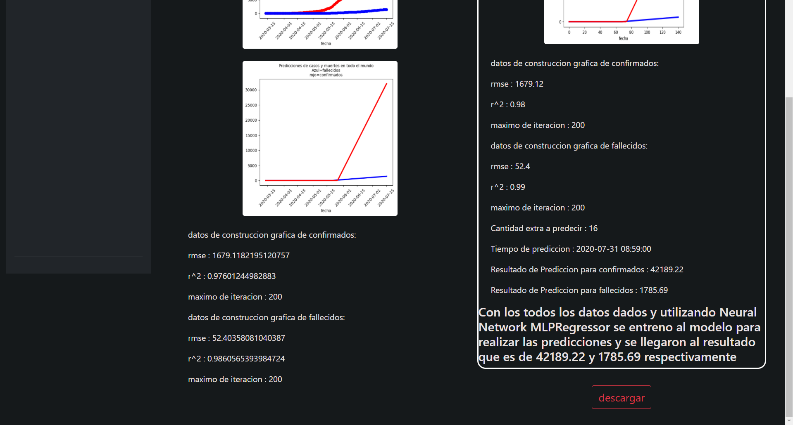

# Proyecto 2 del Curso Organización de Lenguajes y Compiladores 2

Vacaciones de Diciembre 2021

Ing. Luis Fernando Espino Barrios

Aux. Haroldo Pablo Arias Molina

---
## link de la applicacion web:
http://front-p2-c2-dec.s3-website.us-east-2.amazonaws.com/

---
## Tabla de Contenidos
1. [Manual de Usuario](#manualdeusuario)
2. [Manual Técnico](#manualtecnico)

# Manual De usuario <a name="manualdeusuario"></a>

## Coronavirus Data Analysis With Machine Learning


## Barra de Navegacion
En la imagen se nos muestra como es la pantalla principal de la applicacion Coronavirus Data Analysis With Machine Learning

### Carga de Arhivos
Esta es la parte que se inicia por defecto, es decir, el index, con lo que seran lo primero que se encuentre cuando se dirija al link

En este apartado solo tiene una funcionalidad. Tal y como lo dice, es para que se carguen los datos con 4 tipos de formatos, los cuales son:

    .csv 
    .xlsx
    .xls
    .json


Una vez que se haya escogido y mostrado cual es su archivo (como en la imagen anterior) ,  el boton de cargar archivo lo enviara al servidor

***Adertencia***: Actualmente el dato subido podra ser visto por cualquiera que entre, con lo que se recomienda presionar el boton de Eliminar data que esta ubicado en el apartado de **ajuste de parametros** que se mostrara mas adelante


Si no hay arhivo cargados aparecera esta paigna que indica que tiene que ir a cargar un archivo


Si no hay un reporte previamente realizado, aparecera este mensaje pidiendo ir a ajuste de parametros para realizar la respectiva parametrizacion.

## Ajustes de parametros


En este apartado se tratara sobre como su nombre lo indica, parametrizaremos los datos que necesitamos, dependiendo del reporte a elegir.

### 1 Analisis a realizar
Dentro de este apartado elegiremos el analisis que deseamos realizar como lo muestra la imagen siguiente:

Existen 25 analisis que se pueden realizar que son los siguientes:

- Tendencia de la infección por Covid-19 en un País.
- Predicción de Infertados en un País.
- Indice de Progresión de la pandemia.
- Predicción de mortalidad por COVID en un Departamento.
- Predicción de mortalidad por COVID en un País.
- Análisis del número de muertes por coronavirus en un País.
- Tendencia del número de infectados por día de un País.
- Predicción de casos de un país para un año.
- Tendencia de la vacunación de en un País.
- Ánalisis Comparativo de Vacunaciópn entre 2 paises.
- Porcentaje de hombres infectados por covid-19 en un País desde el primer caso activo
- Ánalisis Comparativo entres 2 o más paises o continentes.
- Muertes promedio por casos confirmados y edad de covid 19 en un País.
- Muertes según regiones de un país - Covid 19.
- Tendencia de casos confirmados de Coronavirus en un departamento de un País.
- Porcentaje de muertes frente al total de casos en un país, región o continente.
- Tasa de comportamiento de casos activos en relación al número de muertes en un continente.
- Comportamiento y clasificación de personas infectadas por COVID-19 por municipio en un País.
- Predicción de muertes en el último día del primer año de infecciones en un país.
- Tasa de crecimiento de casos de COVID-19 en relación con nuevos casos diarios y tasa de muerte por COVID-19
- Predicciones de casos y muertes en todo el mundo - Neural Network MLPRegressor
- Tasa de mortalidad por coronavirus (COVID-19) en un país.
- Factores de muerte por COVID-19 en un país.
- Comparación entre el número de casos detectados y el número de pruebas de un país.
- Predicción de casos confirmados por día

Como es de esperarse, cada uno realiza lo que su nombre lo indica, sin embargo, no quiere decir que algunos los vean parecidos, puesto que algunos como son el caso de tendencia y prediccion pueden ser lo mismo con la diferencia que uno si puede predicir una cantidad que desea.


### La parametrizacion
Despues de elegir un analisis, apareceran los parametros necessarios para que pueda realizarse su reporte, de forma general tiene 3 tipos de parametrizacion

    - seleccion de columna
    - ingreso de un numero
    - ingreso de tipos texto

en la seleccion de columna aparecera un listado de todas las columnas que archivo contendra y se da a elegir que elija cual sera

En el ingreso de numero se pedira que ingrese un numero entero mayor a 0, esto es mas para la parte de predicciones

Finalmente en el ingreso de texto, es donde normalmente se pedira que escriba el nombre de un pais, region, departamento o municipio para filtrar esa data.


La imagen anterior es un ejemplo de como se miraria los datos ya ingresados.

## Reporte


Una vez que se haya realizado correctamente la parametrizacion, y presionado el boton de realizar reporte, se redirigira hacia el apartado de reporte, el cual contiene la iformacion que aparece en la imagene de arriba y la imagen de abajo que contiene lo restante del reporte


Parte restante del reporte

### Data
La mayoria de reporte arrojan los mismo datos, el grado con el que se trabajo el previo analisis de las graficas como las tendencias, predicciones y otras.

rmse: es el error medio cuadratico, esto dicta sobre la cantidad absoluta que tiene un punto con el otro ( respecto a la grafica construida)

r^2; es el margen de error que tiene, con lo que si esta cerca a 1, esto se asemeja a un 100% de no errores.

coef : son los coeficientes para la contruccion de una funcion

intercept: es el intercepto que tiene la funcion con la recta x

Para ser mas claros con los coef e intercept, la funcion que se habla es:\

    y = mx + b

donde *m* es igual a coef
y *b* es igual a intercept

cuando se dan varios coef quiere decir que la recta seria:

     y = m1 * x + m2 * x^2 + m3 * x^3 + ..... + b

Esa es la forma de construir las graficas que se hicieron para los reportes.

### Descarga
Como una parte imortante, tener almacenado la informacion es importante con lo que se dio la opcion de descargar el reporte, que es lo que esta encerrado en el cuadro en blanco.

Lo que esta fuera es solo para ver como se realizo el analisis previo, o graficas utilizadas. Con lo que es irrelavante para el reporte.

Las siguientes imagenes muestran como es que se veria el archivo en formato **PDF**:

Parte 1 del arhcivo **PDF**


Parte 2 del archivo **PDF**

# Manual Tecnico <a name="manualtecnico"></a>

## Todas las librerias Utilizadas para la API de Python

```python

    backcall==0.2.0
    click==8.0.3
    colorama==0.4.4
    cycler==0.11.0
    debugpy==1.5.1
    decorator==5.1.0
    entrypoints==0.3
    et-xmlfile==1.1.0
    Flask==2.0.2
    Flask-Cors==3.0.10
    fonttools==4.28.5
    ipykernel==6.6.0
    ipython==7.30.1
    itsdangerous==2.0.1
    jedi==0.18.1
    Jinja2==3.0.3
    joblib==1.1.0
    jupyter-client==7.1.0
    jupyter-core==4.9.1
    kiwisolver==1.3.2
    MarkupSafe==2.0.1
    matplotlib==3.5.1
    matplotlib-inline==0.1.3
    nest-asyncio==1.5.4
    numpy==1.21.5
    openpyxl==3.0.9
    packaging==21.3
    pandas==1.3.5
    parso==0.8.3
    pickleshare==0.7.5
    Pillow==8.4.0
    prompt-toolkit==3.0.24
    Pygments==2.10.0
    pyparsing==3.0.6
    python-dateutil==2.8.2
    pytz==2021.3
    pyzmq==22.3.0
    scikit-learn==1.0.1
    scipy==1.7.3
    six==1.16.0
    threadpoolctl==3.0.0
    tornado==6.1
    traitlets==5.1.1
    wcwidth==0.2.5
    Werkzeug==2.0.2
```

## Librerias Externas utilizadas para el fronted de Angular

- ### jspdf

    es una librería para Java Script que permite generar documentos PDF a partir de una plantilla HTML o directamente por programación. Esto nos permite poder diseñar un documento PDF de manera sencilla y adaptable.

## Diagrama de conexion de forma resumida


De manera simplificada, hay una api escrita en **Python** que realiza todos los analisis y el fronted que fue realizado con el framework basado en tecnologias web **Angular** solo las consume.

## Carga de archivos


Es es el diagrama de eventos de como se comunica el fronted con la api al realizar la carga de datos


## Parametrizacion


Este es el diagrama de eventos de como se comunican cuando se esta parametrizando, desde que se carga hasta que envia los parametros

## Reporte


Este es el diagrama de eventos de como es su comunicacion cuando se consume los reportes.


## Un poco de como viene la informacion
Como se dijo anteriormente, la forma que se maneja esta applicacion web es con una API REST con lo que a conticuancion se mostrara unos ejemplos de como es la data de json que viene para la parametrizacion sea dinamica:

``` json

"Predicción de infectados en un Pais":{
            "caso":2,
            "name":"Predicción de infectados en un Pais",
            "no_parametros": 5,
            "parametros":["tiempo","confirmados","celda_pais"],
            "opcionales": ["celda_pais","nombre_pais"],
            "parametros_numericos":["tiempo_predecir"],
            "parametros_texto":["nombre_pais"]
        }
```

Este es la foma en que se organiza la informacion para que sea recibida por el fronted, enviar los parametros de celda que seria los que tiene el nombre de ``parametros``, luego estan los opcionales ``opcionales`` que son celdas que puede quedar vacias, estan los parametros de texto que son ``parametros_texto`` que es para reconozca el fronted que su atributo va a ser recibido como una cadena y estan los de tipo numerico que serian ``parametros_numericos``.

*Nota* : el atributo ``no_parametros`` es despreciable, no se utiliza en ningun momento.

## Ejecutar localmente

### Fronted

Para angular lo unico que hay que hacer primero es instalar los paquetes:
``` bash

    npm intall

```

dirigirse a 

    src\app\servicios\main.service.ts

dentro se tiene que cambiar los siquiente:

``` typescript

    private BASE_URL = 'http://apic2p2dec-env.eba-gpkjep2y.us-east-2.elasticbeanstalk.com/api';
    BASE_URL_PUBLIC = 'http://apic2p2dec-env.eba-gpkjep2y.us-east-2.elasticbeanstalk.com'    
```

Cambiar a:

``` typescript

    private BASE_URL = 'http://localhost:4000/api';
    BASE_URL_PUBLIC = 'http://localhost:4000'    

```

Luego de se ejecutado seguira el comando:

``` bash

    npm start
     
```
Se utilizara este y no el **ng serve** puesto que tiene una configuracion proxy para que no haya conflicto con el problema muy conocido para estos casos que es el **CORS**


### Python

#### entorno

Lo primero que se debe de realizar es un nuevo entorno para intalar el paquete que dependiendo del sistema operativo puede variar

Windows: 
``` bash

    py -3 -m venv .venv
    .venv\scripts\activate

```
Para macOS/Linux

``` bash

    python3 -m venv .venv
    source .venv/bin/activate

```

#### Instalar los paquetes

Como se vio al inicio de este manual técnico, estan descritas todas las librerias que se necesitan, pero como es de constumbre, dentro esta un documento llamado ``requirements.txt`` que se podra usar para instalar todas las librerias
Como es de costumbre, puede variar la forma de instalacion dependiendo de su sistema

Windows: 
``` powershell

    py -m pip install requirements.txt

```

Para macOS/Linux

``` bash

    python3 -m pip install requirements.txt

```

#### application.py

dentro de la applicacion encontrara codigo comentado:

Al inicio del arhivo:
```python
    # os.environ.update({'ENV': "desarrollo"}) ### Esto deberia ser cambiado ###
    # os.environ.update({'PUERTO': '4000'}) ### Esto deberia ser cambiado ###

```

Al final del arhivo:

```python

    # app.config['DEBUG'] = os.environ.get('ENV') == 'desarrollo'
    # app.run(host='localhost',port=int(os.environ.get('PUERTO')))

```

Hay que quitar el comentado para que funcione el el puerto ``http://localhost:4000``

#### Ejecutar

despues de todo ya solo es cuestion de ejecutarlo

Si tiene el editor de **Visual Studio Code**  con la extension de **Python** solo es de presionar el boton de correr que esta en la esquina superior derecho (triangulo)

sino puede realizalo de forma manual:

Windows:

Opcion 1

``` powershell

    python application.py

```

Opcion 2

``` powershell

    py application.py

```